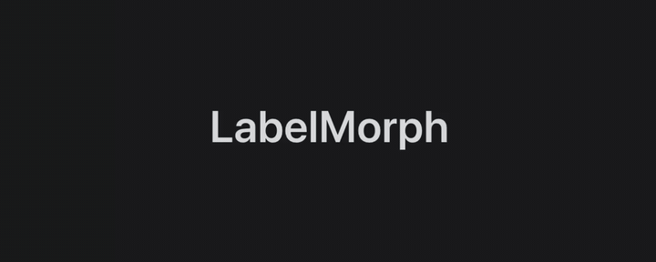
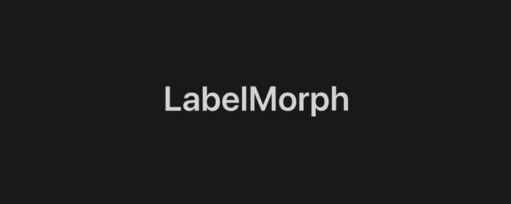
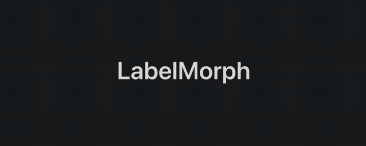
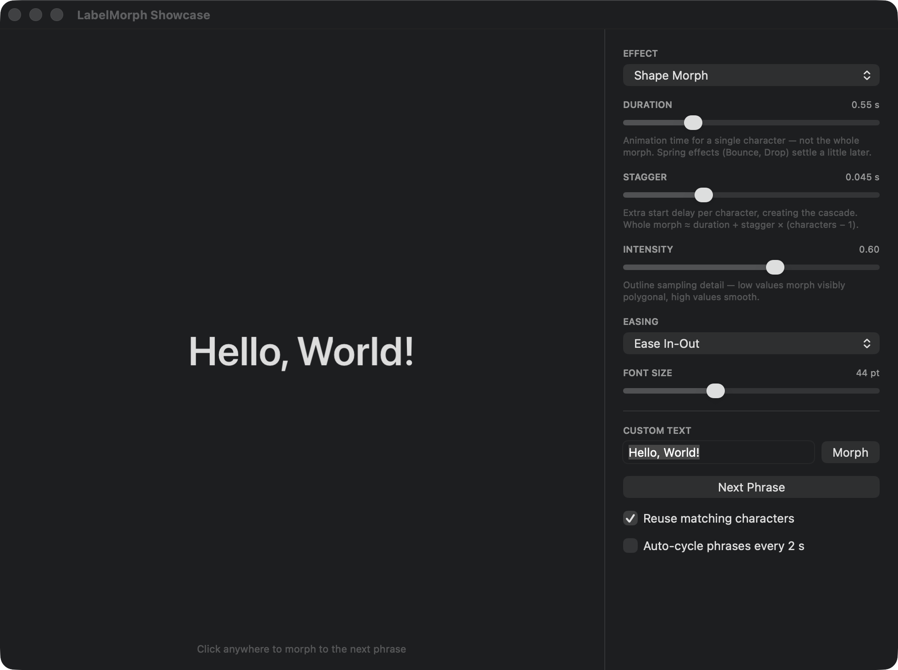

# LabelMorph

An AppKit and UIKit framework for morphing text on a label, character by
character or as a complete line.



`MorphingLabel` lays out its text with Core Text, gives every character its own
layer, and diffs old vs. new text when it changes: characters present in both
strings fly to their new position, removed characters animate out, and added
characters animate in — using a pluggable effect. The signature **Shape Morph**
effect goes further: it extracts the actual glyph outlines from the font and
interpolates one character's shape into the next, in place.

## Usage

```swift
import LabelMorph

let label = MorphingLabel()
label.font = .systemFont(ofSize: 48, weight: .semibold)
#if os(macOS)
label.textColor = .labelColor
#else
label.textColor = .label
#endif
label.effect = MorphPreset.shapeMorph.makeEffect(intensity: 0.7)
label.timing = MorphTiming(duration: 0.55, stagger: 0.045)
label.fadeStyle = .traveling // optional leading-to-trailing opacity wave
label.fadeConfiguration = MorphFadeConfiguration(
    pulseCount: 2,
    minimumOpacity: 0.14,
    pulseDuration: 0.28,
    pauseDuration: 0.12,
    travelDuration: 0.42
)

label.text = "Hello, World!"   // morphs using the current effect
label.setText("Goodbye!", animated: false)
```

`duration` is the animation time for a single character; `stagger` adds a
per-character start delay, so a whole morph takes roughly
`duration + stagger × (characters − 1)`.

`textColor` accepts ordinary, semantic, and custom dynamic `NSColor`/`UIColor` values.
Visible glyphs and an in-flight Shape Morph update automatically when the
label's effective appearance changes. Core Text outlines are converted to the
native coordinate direction on each platform, so Shape Morph stays upright on UIKit.

## Installation

Swift Package Manager:

```swift
.package(url: "https://github.com/everlof/LabelMorph.git", branch: "main")
```

Or generate the Xcode project with [XcodeGen](https://github.com/yonaskolb/XcodeGen)
and embed the `LabelMorph` framework target.

## Built-in presets

| Preset | Behavior |
| --- | --- |
| Shape Morph | Each glyph's outline is broken into contours and morphed into the new glyph in place; added characters grow from points, removed ones collapse into them |
| Crossfade | Old characters fade out, new fade in |
| Slide Up / Slide Down | Characters slide through vertically and fade with the configured cascade |
| Line Scroll Up / Line Scroll Down | The complete old line scrolls and fades out while the complete new line scrolls and fades in from the opposite edge |
| Scale | New characters zoom in, old ones blow up and fade |
| Bounce | Characters spring up from below with overshoot |
| Drop | Characters fall in from above with a tilt and spring landing |
| Flip | Split-flap style rotation around the horizontal axis |
| Blur | Characters sharpen into focus from a gaussian blur |
| Scramble | Characters cycle through random glyphs before settling |
| Typewriter | Typed in front-to-back, deleted back-to-front |

Every preset exposes `recommendedTiming` and takes an `intensity` (0…1) that
scales its parameters (distance, spring damping, blur radius, …).

`fadeStyle = .traveling` is an orthogonal option available to every preset. It
passes a soft, repeating opacity pulse from the leading glyph to the trailing
glyph while the selected effect keeps its own movement, shape, blur, or
replacement motion. `fadeConfiguration` controls the pulse count, opacity
depth, duration of each pulse, full-opacity pause between pulses, and time for
the wave to cross the line. A zero pause produces a continuous pulse train.
Because the opacity envelope lives on a carrier around each glyph position, it
composes with an effect's own fades rather than replacing them.

| Bounce | Scramble | Blur |
| --- | --- | --- |
|  |  |  |

## Custom effects

Implement `TextMorphEffect` to add a new way for text to morph:

```swift
final class MyEffect: TextMorphEffect {
    func animateIn(_ layer: CATextLayer, context: MorphContext) {
        layer.add(context.animation("opacity", from: 0, to: 1), forKey: "in")
    }
    func animateOut(_ layer: CATextLayer, context: MorphContext) {
        layer.add(context.animation("opacity", from: 1, to: 0), forKey: "out")
    }
}
```

`MorphContext` carries the character index, timing, and stagger helpers, and
builds pre-configured basic/spring animations. `animateMove` has a default
implementation (a plain translation animation) you can override.

Conform to `TextReplacementMorphEffect` instead when the effect transforms a
character *in place* (like Shape Morph does): the label then pairs old and new
characters by position and calls `animateReplace(from:to:in:context:)` for
each changed pair.

Conform to `WholeLineMorphEffect` when character identity should not cross the
transition. The label builds both complete glyph runs without diffing or reusing
matching characters, then calls `animateLineTransition(from:to:in:context:)`
once so the effect can move each run in lockstep.

## Showcase app



The `Showcase` target is a small app for playing with the effects. Its picker
groups effects into **Single Character** and **Full Row** sections; the controls
cover duration, stagger, intensity, font size, easing, custom text, phrase
cycling, matching-character reuse, and traveling-fade count/depth/pulse/pause/
travel tuning.

Pass `-fade YES` when launching the Showcase to enable the fade for a scripted
demo. `-fadePause 0` demonstrates the continuous, zero-hold pulse train.

```sh
xcodegen generate
open LabelMorph.xcodeproj   # run the "Showcase" scheme
```

## Performance benchmarks

The package owns opt-in microbenchmarks for the per-glyph traveling-fade setup
and whole-line handoff setup. They stay out of ordinary correctness runs because
XCTest performance baselines are machine-specific:

```sh
LABELMORPH_BENCHMARKS=1 swift test --filter MorphingLabelPerformanceTests
```

## Truncation

A label lays its whole line out from the leading edge, so text wider than the view runs
past it — and a host that clips cuts it dead mid-glyph. Set `truncation` for the usual
ellipsis instead:

```swift
label.truncation = .tail
```

`intrinsicContentSize` still reports the whole text's width, so Auto Layout is told what
the label wants and truncation only describes what it does once given less. The ellipsis is
an ordinary character of the laid-out line, so it morphs like any other: two names sharing
a head animate only where they actually differ.

## Notes / limitations

- Single-line text only (no wrapping); left-to-right scripts.
- Blur uses Core Image on AppKit and falls back to its opacity transition on UIKit.
- Requires macOS 13+ or iOS 17+.

## License

LabelMorph is available under the [MIT License](LICENSE).
